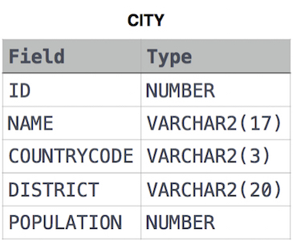

# Task - Revising the SELECT query I:

Query all columns for all American cities in the CITY table with populations larger than 100000. The CountryCode for America is USA.

The CITY table is described as follows:

- SQL query

SELECT \* FROM CITY WHERE COUNTRYCODE = 'USA' AND POPULATION > 100000;

# Task - Revising the SELECT query II:

Query the NAME field for all American cities in the CITY table with populations larger than 120000. The CountryCode for America is USA.

The CITY table is described as follows:

- SQL query

SELECT NAME FROM CITY WHERE COUNTRYCODE = 'USA' AND POPULATION > 120000;

# Task - Select all:

Query all columns (attributes) for every row in the CITY table.

The CITY table is described as follows:

- SQL query
  SELECT \* FROM CITY;

# Task - Select by ID:

Query all columns for a city in CITY with the ID 1661.

The CITY table is described as follows:

- SQL query
  SELECT \* FROM CITY WHERE ID = 1661;
